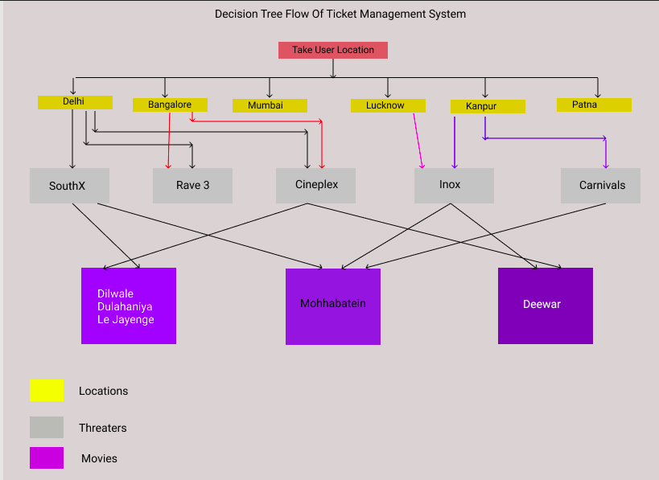

# Movie Ticket Management System

The system should allow user to select movies from a list. Allow them to select seats. Filter the movies by genre and language. Bonus points for filtering the list by taking user location to the theatre destination. (Assume arbitrary location)
Skip through payment process but ensure the final screen has the details of the movie booked with an option to cancel.

##### Preference will be given to folks who write the solution in VanillaJS

#### Data Flow And Design Structure

User will follow a decision tree

##### Steps

- Select User Location
- Based On Location Some movies shown
- After Selecting Movies User should be able to select threater
- Seat Selection and number of seats

#### Todo

- [x] User Able to Select Location
- [x] User Able to Select threater
- [x] User Able to Select Movie
- [x] User Able to Select Seats Choice
- [x] Three Different Classes Of Seats
  - Gold
  - Platinum
  - Silver
- [x] Bill Calculated With Booked Seat Summary
- [x] Confirmation Page
